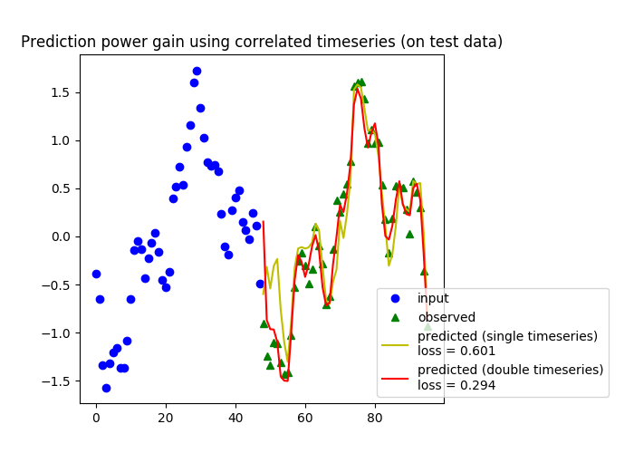

===============================
Parallel Echo State Network
===============================

.. image:: https://img.shields.io/travis/zblanks/parallel_esn.svg
        :target: https://travis-ci.org/zblanks/parallel_esn

This repository contains the code to access the Python package parallel_esn which was developed for the Harvard CS205 final project. The code is under a two clause BSD license. To read the documentation for the package code visit: 

* Documentation: https://zblanks.github.io/parallel_esn.

Background
----------

Echo State Networks (ESN) are recurrent neural networks making use of a single layer of sparsely connected nodes (‘reservoir’). They are often used for time series tasks, and can be less computationally intensive other than deep learning methods. However, ESNs require fine tuning of many parameters, including the input weights, the reservoir (e.g. how many nodes in the reservoir, what is the spectral radius, etc). This has usually been done through either (a) sequential testing and optimization; or (b) instantiating many random instances, and then picking the best performing set of parameters. Depending on the length of the input data and the size of the reservoir, ESNs can thus be computationally intensive to train. In addition, we have to repeat this training many times before arriving at a good set of parameters.

We propose to make use of parallel computing architectures to not only make this process faster, but also smarter. We do this through:

* Setting the reservoir to be a small world network
* Using bayesian optimization to iteratively find the best set of parameters
* Training the network faster through distributed computing with multiple nodes and multiple threads (OpenMP and MPI)

.. figure:: https://raw.githubusercontent.com/rednotion/parallel_esn_web/master/Screenshot%202019-04-30%20at%206.34.15%20PM.png
   :scale: 50 %
   :alt: Echo State Network Diagram
   
   Source: Kawai, Y., Tokuno, T., Park, J., & Asada, M. (2017)

`Additional background on our supporting information page <https://rednotion.github.io/parallel_esn_web/>`_
   
Examples
--------

**Test Example**
The goal of this example is to show that feeding the ESN the time series of multiple correlated features can help in predictions. The sample data is generated as a sum of three sine waves and gaussian noise. In the baseline model, the ESN only has access to this single time series for training and inference. In the other model, the ESN gets the aforementioned time series and a second time series which is correlated with the first: a noise-free sine wave of the same frequency, but different phase, as one of the component sine waves present in the first time series.

Code Description
----------------
The source code used to develop the package as well as run experiments for the project are contained in the /parallel_esn folder. This directory has the following structure:

::

        parallel_esn/
        │   bo.py
        │   esn.py
        │   progress.py
        │   train_esn.pyx
        │   utils.py
        │   _version.py
        │   __init__.py
        │
        ├───data/
        ├───example/
        ├───experiments/
        │       mpi_west_coast_weather.py
        │       profile_mpi.py
        │       profile_seq.py
        │       seq_west_coast_weather.py
        │       __init__.py
        │
        ├───tests/
       
The folders and files of note are as follows:

bo.py_: Defines the class for the Bayesian optimization used to train the echo state network (ESN)

esn.py_: Defines the class used to train and validate an echo state network

train_esn.pyx_: Cython code used to optimize part of the training process

data_: Example data used to check correctness of code implementation

example_: Small scale examples to check correctness of code implementation

tests_: Unit tests to check correctness of functions in the package

seq_west_coast_weather.py_: Sequential code for large scale ESN training and hyper-parameter search

mpi_west_coast_weather.py_: Hybrid parallel code for large scale ESN training and hyper-parameter search

.. _bo.py: https://github.com/zblanks/parallel_esn/blob/master/parallel_esn/bo.py
.. _esn.py: https://github.com/zblanks/parallel_esn/blob/master/parallel_esn/esn.py
.. _train_esn.pyx: https://github.com/zblanks/parallel_esn/blob/master/parallel_esn/train_esn.pyx
.. _data: https://github.com/zblanks/parallel_esn/tree/master/parallel_esn/data
.. _example: https://github.com/zblanks/parallel_esn/tree/master/parallel_esn/example
.. _tests: https://github.com/zblanks/parallel_esn/tree/master/parallel_esn/tests
.. _seq_west_coast_weather.py: https://github.com/zblanks/parallel_esn/blob/master/parallel_esn/experiments/seq_west_coast_weather.py
.. _mpi_west_coast_weather.py: https://github.com/zblanks/parallel_esn/blob/master/parallel_esn/experiments/mpi_west_coast_weather.py

Installation
------------
To install the code, we assume the user is working in a UNIX-enabled environment. All code was tested in an Ubuntu 16.04 operating system. To download the package please take the following steps in the UNIX environment in the order described:

1. sudo apt-get update
2. sudo apt-get install gcc
3. sudo apt-get install libcr-dev mpich mpich-doc
4. wget https://repo.continuum.io/miniconda/Miniconda3-latest-Linux-x86_64.sh
5. bash Miniconda3-latest-Linux-x86_64.sh

        - Allow conda to have access to PATH (i.e., one can type conda ... and this will call the conda package manager)
        
6. Exit shell to allow conda to have access to PATH and log back in
7. conda install numpy
8. git clone https://github.com/zblanks/parallel_esn.git
9. cd parallel_esn
10. pip install -e .

        - This ensures that the Cython code compiles for the package
        
To test that the package was installed correctly, type the following command

::

        python -m parallel_esn.experiments.profile_seq --num_iter 1
        
In the Ubuntu 16.04 OS, you should see the following:

::
        
        Iteration 0
        {'k': 3, 'hidden_dim': 112, 'spectral_radius': 1.2940912584107198, 'p': 0.10919073963823023, 'alpha': 0.8153388906631103, 'beta': 141.20288318144654}
        validation loss = 0.616245337445537

The output may be slightly different depending on the OS, but the iteration number, hyper-parameters, and validation loss should be printed.

Running Experiments
-------------------
The experimental results detailed at https://rednotion.github.io/parallel_esn_web/ were obtained by working on an MPI cluster of m4.2xlarge AWS instances.

Getting Data for Experiments
============================
To get the data that was used for the large-scale sequential and parallel experiments, type the following command:

::

        wget https://raw.githubusercontent.com/rednotion/parallel_esn_web/master/west_coast_weather.csv

This is the data that is used for the sequential and parallel experiments detailed below.

Sequential Experiment
=====================
To run the sequential version of the experiment, type the following commands

::

        export OMP_NUM_THREADS=1
        mkdir figs
        python -m parallel_esn.experiments.seq_west_coast_weather
        
The number of threads is explictly set to one because NumPy, the package used to perform matrix operations in the code, will by default use as many threads as it can find for certain operations such as matrix multiplication. Therefore to ensure that you are running the sequential version this environment variable must be set. Additionally, create the directory figs/ because the code will generate plots which show the test set results from training and validating the ESN. The sequential code has the following command line arguments which can be passed to the module

* --num_iter: Number of Bayesian optimization iterations; default = 1
* --filename: Filename used to call the west coast weather data; default = west_coast_weather.csv
* --outdir: Directory to save the generated figures; default = figs
* --verbose: Controls the verbosity of the training process -- valid values are {0, 1}; default = 0

Hybrid Parallel Experiment
==========================
To run the hybrid parallel version of the experiment, type the following commands

::
        
        mkdir figs-mpi
        mpirun -np x python -m parallel_esn.experiments.mpi_west_coast_weather --outdir figs-mpi --num_threads k
        
The number of threads is controlled by the command line argument --num_threads, which is the only new argument for the script; the rest are the same as the sequential version. The MPI application is controlled through standard MPI commands such as the number of tasks and, if there are multiple nodes, by providing the hosts.
